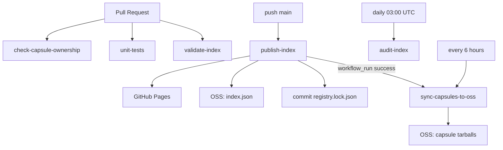

# CI Workflows

This document describes every GitHub Actions workflow in **agcli-registry**: when it runs, what it validates or publishes, and how the pieces fit together.

Workflow definitions live under [`.github/workflows/`](../.github/workflows/).

---

## Overview

Six workflows cover governance, day-to-day validation, unit tests, index publishing, periodic full audits, and capsule tarball mirroring to Alibaba Cloud OSS.



| Workflow | Primary role |
|----------|----------------|
| [check-capsule-ownership](#check-capsule-ownershipyml) | CODEOWNERS ↔ `groups.yaml` alignment; PR group ownership rules |
| [unit-tests](#unit-testsyml) | `pytest` for registry scripts; `bats` for ownership checks |
| [validate-index](#validate-indexyml) | YAML structure + incremental release verification; builds `index.json` in CI (not committed) |
| [publish-index](#publish-indexyml) | Production index publish, lock update, GitHub Pages + OSS index sync |
| [audit-index](#audit-indexyml) | Scheduled full re-download of every capsule release |
| [sync-capsules-to-oss](#sync-capsules-to-ossyml) | Mirror tarball assets from `index.json` into OSS |

---

## Contributor checklist

| Workflow | Pull request | Push to `main` |
|----------|:------------:|:--------------:|
| check-capsule-ownership | Yes | — |
| unit-tests | Yes | Yes |
| validate-index | Yes | Yes |
| publish-index | — | Yes (path filters) |
| audit-index | — | — (schedule / manual only) |
| sync-capsules-to-oss | — | After successful publish, or on schedule |

A typical contribution must pass **ownership** and **validate-index** before merge. After merge, **publish-index** updates the public index and `registry.lock.json`; **sync-capsules-to-oss** then mirrors package tarballs to OSS (or on the next scheduled run).

---

## check-capsule-ownership.yml

**Name:** Check Capsule Ownership

### Triggers

- `pull_request` only

### Purpose

Enforce registry governance: who may change which **group**, and keep [`.github/CODEOWNERS`](../.github/CODEOWNERS) in sync with [`groups.yaml`](../groups.yaml).

### Steps

1. Checkout (full history).
2. Run [`scripts/check-capsule-ownership.sh`](../scripts/check-capsule-ownership.sh) against the PR base commit.

The script checks:

- Every group in `groups.yaml` has a matching `capsules/<group>/` line in CODEOWNERS, and vice versa.
- Owner lists match for each shared group.
- If the PR touches `capsules/<group>/*.yaml`, that group must be declared in CODEOWNERS.
- If the PR touches multiple groups, those groups must share at least one common `@owner` (so one review path can cover the PR).

### Does not

- Download GitHub Releases or build `index.json`.

---

## unit-tests.yml

**Name:** Unit Tests

### Triggers

- `pull_request`
- `push` to `main`

### Purpose

Regression coverage for core registry scripts without network or full-repo integration:

- **`pytest`** — [`scripts/registry_market.py`](../scripts/registry_market.py) (semver, tarball safety, version policy, `scan_capsules`) and [`scripts/registry_release.py`](../scripts/registry_release.py) (GitHub URL parsing, release URL derivation).
- **`bats`** — [`scripts/check-capsule-ownership.sh`](../scripts/check-capsule-ownership.sh) in isolated temporary git repos.

### Local run

```bash
pip install -r requirements-dev.txt
pytest tests/ -v
# bats: apt install bats-core, or brew install bats-core
pip install pyyaml
bats tests/bats/
```

---

## validate-index.yml

**Name:** Validate Market Index

### Triggers

- `pull_request`
- `push` to `main`

### Purpose

Verify that capsule declarations are structurally valid and that a merged `index.json` can be produced with correct release proofs—**without** deploying anything.

### Steps

1. Checkout (full history).
2. Install Python + PyYAML.
3. **PR only:** [`scripts/check-registry-lock.sh`](../scripts/check-registry-lock.sh) — fail if the PR modifies [`registry.lock.json`](../registry.lock.json) (that file is updated only by publish automation on `main`).
4. Detect changed capsules under `capsules/` (PR base vs HEAD; on push, `HEAD~1` vs `HEAD`).
5. Run [`scripts/registry.sh merge`](../scripts/registry.sh):
   - **Pull request:** trust release proofs from **base branch** lock only (`--trust-base-lock-only` + `--base-lock-file` from `origin/<base>`); **force full download** for every changed `group/name`.
   - **Push to `main`:** use the lock file in the repo; force re-verify only changed capsules.
   - Unchanged capsules reuse cached proofs from the lock when fingerprints still match (`version`, `repository`, derived `dist.url`).

### Does not

- Deploy GitHub Pages or OSS.
- Commit `registry.lock.json` or `index.json`.

---

## publish-index.yml

**Name:** Publish Market Index

### Triggers

- `push` to `main` when paths change, including:
  - `capsules/**`
  - `groups.yaml`
  - `registry.lock.json`
  - Registry / publish scripts and this workflow file
- `workflow_dispatch` (optional OSS index dry run via input)

### Purpose

**Publish the live market index:** merge YAML into `index.json`, generate `index.meta.json`, sign `index.json` → `index.json.asc`, update the verification lock, deploy to GitHub Pages, and upload the index to OSS.

### Jobs

| Job | Purpose |
|-----|---------|
| **build** | Incremental `registry.sh merge --write-lock` (force re-verify capsules changed in the push); [`generate-index-meta.sh`](../scripts/generate-index-meta.sh); verify meta hash; [`sign-index.sh`](../scripts/sign-index.sh) (requires `REGISTRY_GPG_*` secrets); upload artifact (`index.json`, `index.json.asc`, `index.meta.json`, `registry.lock.json`). |
| **update-lock** | Commit and push `registry.lock.json` using a dedicated GitHub App token if the lock changed (the only automated path allowed to edit the lock). See [Registry lock bot](#registry-lock-bot-github-app). |
| **deploy-pages** | Deploy `index.json`, `index.json.asc`, and `index.meta.json` to **GitHub Pages** (e.g. `https://registry.agcli.dev/`). |
| **sync-oss** | Upload index files via [`sync-index-to-oss.sh`](../scripts/sync-index-to-oss.sh) (runs in parallel with Pages deploy). |

### Manual dispatch

- Input `dry_run`: when `true` on manual runs, OSS **index** upload can run in dry-run mode while Pages deployment still proceeds (see workflow `DRY_RUN` expression).

### Related automation

A successful **Publish Market Index** run triggers [sync-capsules-to-oss](#sync-capsules-to-ossyml) via `workflow_run`.

### Registry lock bot (GitHub App)

The `update-lock` job pushes `registry.lock.json` to `main` after each publish. The default `GITHUB_TOKEN` **cannot** bypass repository rulesets (required PR, status checks, etc.), so this job authenticates with a dedicated **GitHub App** installation token via [`actions/create-github-app-token`](https://github.com/actions/create-github-app-token).

**One-time setup (maintainers):**

1. **Create a GitHub App** (org or repo settings → Developer settings → GitHub Apps), for example `agcli-registry-lock`.
   - **Repository permissions:** Contents → Read and write.
   - **Webhook:** inactive (not required).
   - On the app **General** page (scroll down): **Private keys** → Generate a private key (download the `.pem` once).
   - Note the **App ID** from the About section.
2. **Install the app** on `agcli-registry` only (Install App → select the org → Only select repositories).
3. **Repository secrets and variables** (Settings → Secrets and variables → Actions):
   - Variable `REGISTRY_LOCK_APP_ID` — App ID.
   - Secret `REGISTRY_LOCK_APP_PRIVATE_KEY` — full PEM private key.
4. **Ruleset for `main`** (Settings → Rules → Rulesets):
   - Add the app to the ruleset **Bypass list**, mode **Always allow** (so `update-lock` can push the lock).
   - Keep **Require a pull request**, **Required status checks**, and Code Owner review for human contributors.
   - **Do not** enable **Restrict updates** with *only* the app on the bypass list — that blocks normal PR merges to `main`. Turning off Restrict updates still leaves `main` protected via PR, checks, and reviews.

**Workflow behavior:** `update-lock` mints an installation token, checks out `main` with that token, applies the artifact `registry.lock.json`, commits if changed, and pushes. Commit author remains `github-actions[bot]`; the push identity is the app (must match the bypass entry).

**Troubleshooting:**

| Symptom | Likely fix |
|---------|------------|
| `GH013` / Cannot update protected ref on push | App missing from ruleset bypass, or push still uses `GITHUB_TOKEN`. |
| PR merge blocked with same error | **Restrict updates** enabled with bypass limited to the app only — disable it or add maintainer bypass (prefer disabling). |
| Auth errors in `update-lock` | Verify App ID/PEM secrets, Contents permission, and installation on this repo. |

---

## audit-index.yml

**Name:** Audit Market Index

### Triggers

- Schedule: daily at **03:00 UTC** (`0 3 * * *`)
- `workflow_dispatch`

### Purpose

**Full security audit:** ignore `registry.lock.json` caching and re-download every capsule tarball from GitHub Releases, verifying SHA-256 and in-archive `capsule.yaml` identity.

### Steps

1. Checkout, install PyYAML.
2. `registry.sh merge --verify-all` (no lock write, no deploy).

### vs validate-index

| | validate-index | audit-index |
|--|----------------|-------------|
| Frequency | Every PR and push to `main` | Daily + manual |
| Verification | Incremental (lock + changed capsules) | Full re-download for all capsules |
| Output | CI-only `index.json` | CI-only `index.json` |

This catches tampered or replaced Release assets that an stale lock might otherwise miss.

---

## sync-capsules-to-oss.yml

**Name:** Sync Capsules To OSS

### Triggers

- `workflow_run` after **Publish Market Index** completes successfully on `main`
- Schedule: every **6 hours** (`0 */6 * * *`)
- `workflow_dispatch` (optional `index_url`, `dry_run`, `max_capsules`)

### Purpose

Mirror **capsule tarballs** (not the index JSON) to Alibaba Cloud OSS for domestic acceleration. Reads the public index (default `https://registry.agcli.dev/index.json`), downloads each `dist.url`, verifies `integrity.sha256`, and uploads content-addressed objects if missing or changed.

### Steps

1. Checkout.
2. Validate OSS secrets.
3. Install `jq`, `curl`, and [`install-ossutil.sh`](../scripts/install-ossutil.sh).
4. Resolve index URL (default or workflow input).
5. Run [`sync-capsules-to-oss.sh`](../scripts/sync-capsules-to-oss.sh).

### Conditions

- When triggered by `workflow_run`, runs only if the publish workflow **conclusion is `success`**.

### Does not

- Build or deploy `index.json`.
- Update `registry.lock.json`.

### Distinction from publish `sync-oss` job

| Component | publish-index `sync-oss` | sync-capsules-to-oss |
|-----------|--------------------------|----------------------|
| Files | `index.json`, `index.meta.json` | Per-capsule `.tar.gz` from index entries |
| Script | `sync-index-to-oss.sh` | `sync-capsules-to-oss.sh` |

---

## Scripts referenced by workflows

| Script | Used by |
|--------|---------|
| [`registry.sh`](../scripts/registry.sh) / [`registry_market.py`](../scripts/registry_market.py) | validate-index, publish-index, audit-index |
| [`registry_release.py`](../scripts/registry_release.py) | URL derivation (imported by registry_market) |
| [`check-capsule-ownership.sh`](../scripts/check-capsule-ownership.sh) | check-capsule-ownership |
| [`check-registry-lock.sh`](../scripts/check-registry-lock.sh) | validate-index (PR) |
| [`generate-index-meta.sh`](../scripts/generate-index-meta.sh) | publish-index |
| [`sign-index.sh`](../scripts/sign-index.sh) | publish-index |
| [`verify-index-signature.sh`](../scripts/verify-index-signature.sh) | local / debugging |
| [`sync-index-to-oss.sh`](../scripts/sync-index-to-oss.sh) | publish-index |
| [`sync-capsules-to-oss.sh`](../scripts/sync-capsules-to-oss.sh) | sync-capsules-to-oss |
| [`install-ossutil.sh`](../scripts/install-ossutil.sh) | publish-index, sync-capsules-to-oss |

For lock file semantics and schema, see [registry-yaml-spec.md §7](registry-yaml-spec.md#7-registrylockjson-release-proofs).

---

## Related documentation

| Document | Content |
|----------|---------|
| [contributing.md](contributing.md) | How to submit packages and fix CI failures |
| [registry-yaml-spec.md](registry-yaml-spec.md) | YAML and lock file specification |
| [publish-to-github-pages.md](setupdocs/publish-to-github-pages.md) | Pages deployment checklist |
| [github-repository-setup.md](setupdocs/github-repository-setup.md) | Branch protection, secrets, Actions settings |
